# Anchor — Contexto, Arquitetura e Estado do Projeto

> **Snapshot de referência:** 2 de setembro de 2026
> **Estado:** plataforma de diagnóstico validada em hardware real; variante Android standalone interna automatizada, construída, instalada e validada fisicamente sem Metro e sem `adb reverse`
> **Objetivo deste documento:** ser a fonte de contexto para pessoas e agentes que continuarem o projeto sem depender do histórico de chats.

## 1. Resumo executivo

O Anchor é um projeto pessoal para investigar se uma referência visual sincronizada com o movimento de um veículo pode reduzir o conflito sensorial associado à cinetose durante o uso de um computador em carros, autocarros ou comboios.

O sistema usa dois dispositivos:

- um celular Android como fonte física de movimento;
- um computador Windows ou Linux como receptor e, futuramente, como overlay visual.

Neste momento, o pipeline técnico básico funciona de ponta a ponta em hardware real:

1. o Android lê aceleração linear, gravidade e giroscópio;
2. o app cria amostras versionadas a aproximadamente 60 Hz;
3. cada amostra é serializada como JSON em um datagrama UDP;
4. o desktop recebe, limita, valida e ordena os pacotes em Rust;
5. o frontend Tauri exibe os dados e métricas em tempo real.

O que existe hoje é uma plataforma de diagnóstico de movimento e transporte. O horizonte artificial/overlay terapêutico ainda não foi implementado, e a eficácia contra cinetose ainda não foi estudada nem demonstrada.

## 2. Problema e hipótese do produto

A hipótese que motiva o Anchor é a seguinte:

- o ouvido interno percebe acelerações, curvas e inclinações do veículo;
- os olhos, concentrados em uma tela aparentemente estática, recebem uma referência visual incompatível;
- essa discordância sensorial pode provocar ou agravar enjoo de movimento;
- uma referência visual discreta e sincronizada com o movimento real pode ajudar a reduzir essa discordância.

A visão de produto é uma aplicação de desktop quase invisível: leve, sempre disponível e capaz de desenhar um horizonte, pontos ou outro padrão visual por cima das aplicações do usuário sem impedir o trabalho.

Essa visão é uma hipótese de produto, não uma alegação médica. O projeto ainda precisa estudar literatura, segurança, latência tolerável e validação com usuários antes de afirmar benefício clínico ou terapêutico.

## 3. Princípios de arquitetura

As decisões atuais seguem estes princípios:

1. **Baixa latência acima de entrega perfeita.** Dados de movimento antigos perdem valor rapidamente; por isso o stream usa UDP e não retransmite amostras perdidas.
2. **Amostras completas e independentes.** Cada datagrama carrega uma amostra inteira, de modo que a perda de um pacote não impede a leitura do seguinte.
3. **Contrato antes do transporte.** O protocolo v1 é versionado e validado de forma equivalente em TypeScript e Rust.
4. **Rust no caminho crítico do desktop.** Rede, parsing e estado do receptor ficam no backend Tauri/Rust.
5. **Código nativo no caminho crítico do Android.** Sensores e socket UDP usam módulos Kotlin/TurboModule; React Native coordena estado e interface.
6. **Estado observável.** Mobile, receptor e desktop expõem métricas para que falhas não pareçam sucesso silencioso.
7. **Lifecycle seguro.** Pausa, destruição ou encerramento do app devem parar sensores, socket, workers e Promises pendentes.
8. **Escopo incremental.** Descoberta, pareamento, segurança, overlay e filtros só entram depois que a fatia anterior estiver comprovada.

## 4. Arquitetura atual

```mermaid
flowchart LR
    subgraph Android[Android — React Native + Kotlin]
        Sensors[Sensores Android\nlinear acceleration\ngravity\ngyroscope]
        Aggregator[MotionFrameAggregator\nclock monotônico\nsequence\nlimite 60 Hz]
        JS[MotionCaptureController\nvalidação e serialização]
        Sender[SequentialUdpSender\n1 envio em voo\nlatest-wins]
        Socket[UdpSocketTransport\nDatagramSocket]
        Sensors --> Aggregator --> JS --> Sender --> Socket
    end

    Contract[MotionSampleV1\nJSON UTF-8\nprotocolo v1\n≤ 1024 bytes]
    Network[Wi-Fi/LAN\nUDP porta 57421]

    subgraph Desktop[Desktop — Tauri v2 + Rust + React]
        Receiver[Receptor UDP Rust\nbind 0.0.0.0:57421]
        Validation[Parse + validação\nrate limit + sessão + ordem]
        State[ReceiverState\núltima amostra + métricas]
        Bridge[Ponte Tauri\nevento + snapshot]
        UI[Diagnóstico React]
        Receiver --> Validation --> State --> Bridge --> UI
    end

    Socket --> Contract --> Network --> Receiver
```



### Fluxo de uma amostra

1. O Android registra `TYPE_LINEAR_ACCELERATION`, `TYPE_GRAVITY` e `TYPE_GYROSCOPE` em uma `HandlerThread` dedicada.
2. `MotionFrameAggregator` guarda o último valor de cada sensor e emite no máximo 60 frames por segundo, acionado pelas atualizações do giroscópio.
3. A sessão recebe UUID, sequência `u32` crescente e relógio monotônico relativo em microssegundos.
4. O frame passa para o JavaScript pelo TurboModule.
5. O JavaScript converte e valida o frame como `MotionSampleV1`, serializa JSON UTF-8 e verifica o limite de 1024 bytes.
6. `SequentialUdpSender` mantém apenas um envio nativo pendente. Sob pressão, preserva somente a amostra mais nova.
7. O módulo UDP Kotlin envia o datagrama ao IPv4 e porta escolhidos manualmente.
8. O receptor Rust aceita o datagrama, aplica rate limit, limite de tamanho, parse, validação semântica, sessão e ordenação.
9. Uma amostra aceita atualiza o estado compartilhado e é publicada ao frontend por evento Tauri.
10. O frontend também lê snapshots periódicos para status e métricas.

## 5. Estrutura do monorepo

```text
Anchor/
├── apps/
│   ├── desktop/                 # Tauri v2: Rust + React
│   └── mobile/                  # React Native Android + módulos Kotlin
├── packages/
│   └── protocol/                # Contrato MotionSampleV1, schema e fixtures
├── tools/
│   └── motion-simulator/        # Publicador UDP local para testes
├── docs/                        # Briefings e documentação do projeto
├── package.json                 # Scripts de orquestração da raiz
├── pnpm-lock.yaml
└── pnpm-workspace.yaml
```

O workspace usa pnpm e inclui `apps/*`, `packages/*` e `tools/*`.

## 6. Protocolo de movimento v1

O JSON Schema em `packages/protocol/schema/motion-sample.v1.schema.json` é a especificação normativa. Mudanças incompatíveis devem criar uma nova versão do protocolo.

### Campos

| Campo | Tipo/limite | Significado |
|---|---:|---|
| `protocolVersion` | constante `1` | versão do contrato |
| `kind` | `motion_sample` | discriminador da mensagem |
| `sessionId` | string de 1 a 64 caracteres | identificador opaco, não é autenticação |
| `sequence` | inteiro `0..4294967295` | ordem monotônica na sessão |
| `sessionElapsedUs` | inteiro `0..9007199254740991` | microssegundos desde o começo da sessão |
| `linearAccelerationMps2` | `Vector3`, cada eixo em `-200..200` | aceleração sem gravidade em m/s² |
| `gravityMps2` | `Vector3`, cada eixo em `-20..20` | vetor de gravidade em m/s² |
| `angularVelocityRadS` | `Vector3`, cada eixo em `-100..100` | velocidade angular em rad/s |

`Vector3` contém exatamente `x`, `y` e `z`, todos numéricos e finitos. Campos desconhecidos são rejeitados.

### Referencial adotado

- X positivo: direita do veículo;
- Y positivo: frente do veículo;
- Z positivo: cima.

O uso atual pressupõe o celular deitado, tela para cima, em retrato e com a borda superior apontando para a frente do veículo. Parado nessa posição, `gravityMps2.z` deve ficar próximo de `-9.80665`.

### Regras de transporte

- um JSON completo por datagrama;
- codificação UTF-8;
- máximo de 1024 bytes;
- sem fragmentação lógica;
- sem ACK ou retransmissão;
- relógio monotônico relativo, nunca timestamp Unix.

As mesmas fixtures válidas e inválidas são usadas pelos testes TypeScript e Rust.

## 7. Aplicação mobile

### Stack

- React Native 0.83;
- TypeScript/React para controller e interface;
- Kotlin e TurboModules Codegen para sensores e UDP;
- Android é a única plataforma implementada.

### Responsabilidades nativas

`NativeMotionSensorsModule`:

- detecta os três sensores obrigatórios;
- registra sensores fora da thread principal;
- cria uma sessão com UUID;
- usa `SystemClock.elapsedRealtimeNanos()`;
- limita emissão a 60 Hz;
- encerra captura em pause/destroy/invalidate;
- não reativa sensores silenciosamente em background.

`NativeUdpSenderModule` e `NativeUdpSenderController`:

- validam IPv4 e porta;
- possuem um worker e um transporte por sessão manual;
- serializam operações do socket;
- encerram worker, socket e Promises pendentes no lifecycle;
- impedem que uma abertura antiga ressuscite ou feche uma sessão nova;
- permitem que `close()` interrompa um envio bloqueado sem manter o lock do estado.

### Responsabilidades JavaScript

`MotionCaptureController`:

- coordena abertura UDP antes de iniciar sensores;
- converte frames nativos em `MotionSampleV1`;
- rejeita estrutura, limites ou números inválidos;
- calcula taxa observada e idade da amostra;
- transita entre `checking_sensors`, `ready`, `starting`, `active`, `stale`, `stopped`, `unsupported` e `error`;
- encerra captura quando o app sai do primeiro plano.

`SequentialUdpSender`:

- mantém no máximo um `send()` em voo;
- guarda no máximo uma amostra pendente;
- usa coalescência latest-wins;
- contabiliza backpressure, rejeições e erros;
- ignora resoluções tardias de gerações antigas.

### Interface atual

A tela `Anchor Sensor` é uma interface de diagnóstico, não a experiência final. Ela mostra:

- disponibilidade de sensores;
- IPv4 e porta do computador;
- estado do transporte;
- sessão, sequência, taxa e idade;
- métricas de envio;
- vetores atuais;
- instrução de posicionamento;
- aviso explícito de que UDP não confirma recebimento.

O destino é informado manualmente e não é persistido.

### Metro e desenvolvimento em dispositivo físico

`apps/mobile/metro.config.js` observa a raiz do monorepo e os `node_modules` mobile/raiz para resolver os links simbólicos do pnpm e o pacote `@anchor/protocol`.

O workspace `anchor-mobile` também declara `hermes-compiler@0.14.0` diretamente para expor um caminho estável em `apps/mobile/node_modules/hermes-compiler/hermesc/%OS-BIN%/hermesc`, compatível com a resolução esperada pelo plugin Gradle do React Native em ambiente pnpm.

O APK debug atual não contém um bundle JavaScript standalone. Para desenvolvimento físico:

```bash
pnpm dev:mobile
adb reverse tcp:8081 tcp:8081
```

O Metro precisa continuar aberto. O `adb reverse` é usado apenas pelo bundle de desenvolvimento; os datagramas do Anchor continuam seguindo por UDP/Wi-Fi até o IPv4 LAN informado na tela.

Além do debug, agora existe uma variante Android interna `standalone` que:

- é `non-debuggable`;
- incorpora bundle JavaScript e Hermes no APK;
- usa `applicationId` final `com.anchormobile.standalone` para coexistir com `com.anchormobile`;
- usa `versionNameSuffix` `-standalone` e rótulo de aplicação distinto;
- usa a debug keystore apenas para testes internos.

Essa variante não substitui um futuro `release` de distribuição e não deve ser tratada como artefato de produção.

Nesta data, a implementação automatizada da variante standalone existe, o APK foi construído, inspecionado, instalado e validado fisicamente. O app `standalone` abriu sem Metro e sem `adb reverse`, coexistiu com o app debug por causa do `applicationIdSuffix`, e a comunicação Android → Wi-Fi → desktop funcionou no fluxo físico completo da fatia A1.

## 8. Aplicação desktop

### Stack

- Tauri v2;
- Rust/Tokio para rede e estado;
- React/TypeScript para diagnóstico;
- tray icon já existente;
- desenvolvimento e teste físico atual realizados em Linux.

### Receptor UDP

- bind: `0.0.0.0:57421`;
- aceita tráfego por todas as interfaces IPv4;
- taxa esperada: 60 Hz;
- limite técnico: 240 datagramas por segundo;
- buffer detecta payloads acima de 1024 bytes;
- logs são agregados, sem log por pacote.

### Estado, sessão e ordenação

- a primeira amostra válida estabelece a sessão ativa;
- na mesma sessão, `sequence` precisa ser estritamente crescente;
- duplicados e fora de ordem são ignorados e contabilizados;
- uma sessão diferente só assume após 1 segundo sem amostra válida;
- rollover de `u32` não é suportado no MVP;
- a última amostra válida é preservada para diagnóstico.

Status:

- `active`: amostra válida recebida há no máximo 250 ms;
- `stale`: sem amostra válida por mais de 250 ms;
- `disconnected`: sem amostra válida por mais de 1 segundo.

Métricas:

- datagramas recebidos;
- amostras aceitas;
- oversized;
- inválidos;
- duplicados/fora de ordem;
- sessão estrangeira;
- rate limited.

### Ponte Tauri e diagnóstico

O backend publica a última amostra aceita no evento `anchor-motion-sample-v1`. O frontend recebe esse evento para movimento ao vivo e consulta `get_receiver_snapshot` sequencialmente a cada 250 ms para estado e métricas.

A visualização atual move um marcador diretamente com `linearAccelerationMps2.x/y`. Ela não integra posição, não estima orientação e não representa ainda o horizonte artificial final.

O frontend de diagnóstico mostra `Receptor UDP (todas as interfaces IPv4, porta 57421)`, coerente com o bind real em `0.0.0.0:57421`.

## 9. Simulador de movimento

`@anchor/motion-simulator` permite validar protocolo e receptor sem celular.

Características:

- UDP via `node:dgram`;
- padrões `stationary` e `sine`;
- destino padrão `127.0.0.1:57421`;
- taxa configurável de 1 a 120 Hz, padrão 60 Hz;
- UUID e sequência por execução;
- relógio monotônico;
- limite de 1024 bytes;
- scheduler sequencial baseado em deadlines monotônicos, sem envios sobrepostos nem deriva acumulada;
- shutdown idempotente inclusive no caminho de erro.

Exemplo:

```bash
pnpm dev:simulator -- --duration 5 --pattern sine --rate 60
```

## 10. Validação física concluída

Em 25 de agosto de 2026, a primeira fatia vertical foi validada com um celular Android real e o desktop em Linux na mesma rede Wi-Fi.

### Evidência observada

- destino configurado no mobile: `192.168.1.209:57421`;
- remetente visto pelo desktop: `192.168.1.225:54996`;
- status mobile: ativo;
- status desktop: ativo;
- sensores linear, gravity e gyro: disponíveis;
- idade mostrada pelo snapshot do desktop: 7 ms;
- datagramas recebidos: 1607;
- amostras aceitas: 1607;
- oversized: 0;
- inválidos: 0;
- duplicados/fora de ordem: 0;
- sessão estrangeira: 0;
- rate limited: 0;
- sequência observada avançando de 9448 para 10220;
- gravidade em Z próxima de `-9.80 m/s²` com o aparelho parado.

Isso comprova, para esse ambiente, o funcionamento de sensores → módulos nativos → React Native → protocolo → UDP/Wi-Fi → Rust → Tauri → diagnóstico.

O valor de 7 ms é a idade local da última amostra quando o snapshot foi lido. Ele não mede sozinho a latência ponta a ponta entre clocks dos dois dispositivos.

Em 2 de setembro de 2026, a fatia A1 também foi validada fisicamente com o APK Android `standalone`, sem Metro e sem `adb reverse`.

### Evidência observada na validação standalone

- o APK `standalone` foi instalado e abriu sem erro de bundle, sem ecrã vermelho e sem tentativa de dependência do Metro;
- o `adb reverse` para a porta `8081` não foi usado durante o ensaio;
- a comunicação Android → Wi-Fi → desktop funcionou no fluxo físico completo;
- checklist físico da fatia A1 concluído pelo usuário sem erros;
- taxa aproximada observada no Android: `60,2 Hz`;
- sensores linear, gravity e gyro: disponíveis;
- mais de `1.300` pacotes enviados;
- zero descartes por backpressure;
- zero payloads rejeitados;
- zero erros de envio.

Isso comprova, para esse ambiente, que a variante Android `standalone` interna abre e transmite corretamente sem Metro e sem `adb reverse`, preservando o fluxo físico Android → Wi-Fi → desktop.

## 11. Marcos já concluídos

| Commit | Marco |
|---|---|
| `06a02aff` | fundação do monorepo estabilizada |
| `67072619` | contrato `MotionSampleV1` v1 definido |
| `d430fad5` | receptor UDP local e simulador |
| `2801cef4` | ponte Tauri e UI de diagnóstico |
| `937b91ea` | pipeline nativo de sensores Android |
| `99c142d0` | streaming Android → desktop por UDP |
| `039e1ddc` | bundle Metro compatível com monorepo pnpm |

## 12. Comandos operacionais

Instalar dependências:

```bash
pnpm install
```

Desktop e simulador:

```bash
pnpm dev:desktop
pnpm dev:simulator
```

Mobile com Metro:

```bash
pnpm dev:mobile
adb reverse tcp:8081 tcp:8081
```

Instalar o APK debug já construído:

```bash
adb install -r apps/mobile/android/app/build/outputs/apk/debug/app-debug.apk
```

Bundle Metro de integração:

```bash
pnpm verify:mobile:bundle
```

Build Android standalone interna:

```bash
pnpm build:mobile:standalone
```

Validações principais:

```bash
pnpm test:desktop
pnpm test:mobile:standalone-scripts
pnpm typecheck
pnpm --filter anchor-mobile test -- --runInBand
pnpm --filter anchor-mobile lint
pnpm protocol:test
pnpm test:simulator
pnpm build:desktop:frontend
cargo test protocol --manifest-path apps/desktop/src-tauri/Cargo.toml
cargo test receiver --manifest-path apps/desktop/src-tauri/Cargo.toml
cargo fmt --check --manifest-path apps/desktop/src-tauri/Cargo.toml
cargo check --manifest-path apps/desktop/src-tauri/Cargo.toml
cargo clippy --all-targets --all-features --manifest-path apps/desktop/src-tauri/Cargo.toml -- -D warnings
git diff --check
```

Validações Android exigem JDK 21 e Android SDK configurados:

```bash
cd apps/mobile/android
./gradlew :app:generateCodegenArtifactsFromSchema
./gradlew :app:testDebugUnitTest
./gradlew :app:assembleDebug
./gradlew :app:assembleStandalone
./gradlew :app:lintDebug
./gradlew :app:lintStandalone
```

## 13. O que ainda não existe

- horizonte artificial/overlay final;
- janela transparente, always-on-top e click-through;
- modelo de movimento, orientação ou fusão de sensores destinado ao visual;
- calibração/zero do posicionamento;
- compensação de drift e jitter;
- interpolação para renderização independente da taxa da rede;
- medição formal de latência ponta a ponta e jitter;
- descoberta automática do desktop;
- pareamento, autenticação ou criptografia;
- ACK ou canal de controle;
- persistência do destino;
- reconexão automática;
- transporte USB de dados do produto;
- app iOS;
- empacotamento e validação Windows;
- autostart, configuração completa do tray e gestão de firewall;
- estudos em veículo e validação de eficácia contra cinetose.

## 14. Riscos e decisões abertas

### Segurança de rede

O receptor aceita UDP em todas as interfaces IPv4, sem autenticação ou criptografia. Ele deve ser usado apenas em rede local confiável e protegido pelo firewall. Não se deve expor a porta 57421 à internet.

### Eficácia e segurança humana

Uma visualização atrasada, instável ou com movimento errado pode ser inútil ou até piorar o desconforto. Antes de testes prolongados, será necessário definir limites, comportamento de falha e critérios de interrupção.

### Referencial e montagem

O referencial atual depende de uma orientação física obrigatória. Na prática, veículos, suportes e usuários variarão; será necessário calibrar, detectar orientação ou permitir perfis de montagem.

### Modelo visual

Ainda não foi decidido se o melhor estímulo será horizonte, pontos periféricos, partículas, barras ou combinação. Também não está decidido se a transformação deve usar aceleração, gravidade, orientação integrada, fusão de sensores ou um modelo híbrido.

### Latência

A meta histórica mencionada nos briefings é inferior a 20 ms, mas isso ainda não foi medido de forma confiável. Clocks independentes entre celular e PC tornam a medição direta mais difícil e exigem um plano específico.

### UDP e confiabilidade

O stream deliberadamente não confirma entrega. Um futuro canal de controle pode oferecer descoberta, estado e pareamento sem transformar o stream de movimento em TCP.

### Portabilidade

O objetivo inclui Windows e Linux, mas a validação física atual cobre Android + Linux. Transparência e click-through variam entre Windows, X11 e Wayland e precisam de protótipos por plataforma.

## 15. Próximas fases recomendadas

### Fase A — Fechar a plataforma de diagnóstico

Concluída em 2 de setembro de 2026.

1. Corrigir o rótulo de entrada do desktop para refletir `0.0.0.0:57421`/todas as interfaces IPv4.
2. Criar um APK standalone de teste que não dependa do Metro.
3. Transformar o bundle Metro real em uma verificação repetível do projeto.
4. Formalizar e executar um checklist de teste físico, incluindo start, stop, background, retorno, nova sessão e perda de rede.

### Fase B — Dados e modelo de movimento

1. Registrar datasets controlados: parado, inclinações, rotações, aceleração/frenagem e curvas.
2. Verificar e documentar eixos e sinais em cada movimento.
3. Definir uma operação de calibração/zero.
4. Comparar filtro complementar, filtros passa-baixa e outras abordagens de fusão.
5. Definir como o sistema reage a pacote perdido, jitter, stale e disconnect.
6. Medir taxa, interarrival, jitter e uma aproximação defensável de latência ponta a ponta.

### Fase C — Primeiro overlay experimental

1. Criar uma janela transparente e always-on-top.
2. Implementar click-through com modo explícito de configuração.
3. Renderizar um estímulo mínimo baseado no modelo definido na fase anterior.
4. Separar taxa de renderização da taxa do sensor e interpolar quando necessário.
5. Adicionar limites de amplitude, suavização e retorno seguro ao neutro.

### Fase D — Experiência de conexão

1. Descoberta local do desktop, provavelmente por mDNS/ZeroConf.
2. Seleção e persistência segura do computador.
3. Pareamento/autenticação e desenho do canal de controle.
4. Reconexão explícita e feedback verdadeiro de recepção.
5. Avaliar USB como transporte de produto, separado do `adb reverse` de desenvolvimento.

### Fase E — Produto multiplataforma

1. Tray e autostart completos.
2. Empacotamento Linux e Windows.
3. Testes em X11, Wayland e Windows.
4. Consumo de CPU, memória e bateria.
5. Estudos progressivos em veículo e avaliação responsável de conforto.

## 16. Forma de colaboração adotada

- **Teaga:** proprietário do projeto, visão de produto, decisões finais e testes físicos.
- **Atlas/Codex:** parceiro de arquitetura, planejamento, revisão técnica e documentação.
- **OpenCode usando Codex:** desenvolvedor principal responsável pela implementação orientada por prompts e revisões.

O fluxo acordado é:

1. Atlas define a próxima fatia e os critérios de aceite;
2. OpenCode implementa sem commit;
3. Atlas revisa código, testes, concorrência e aderência arquitetural;
4. correções são aplicadas até aprovação;
5. Teaga executa o commit e, quando aplicável, o teste físico.

## 17. Hierarquia da documentação

- Este arquivo descreve contexto, arquitetura e estado consolidado.
- `docs/MissionBriefing.md` preserva a missão original.
- `docs/TecnicalMissionBriefing.md` preserva o briefing técnico inicial, que pode conter hipóteses já superadas.
- Os READMEs de `apps/mobile`, `apps/desktop`, `packages/protocol` e `tools/motion-simulator` descrevem operação local de cada componente.
- O JSON Schema do protocolo é normativo e prevalece sobre descrições informais do payload.
- Código e testes prevalecem quando um documento de status estiver desatualizado.

Este snapshot deve ser atualizado ao final de cada nova fatia vertical ou sempre que uma decisão arquitetural alterar protocolo, transporte, modelo de movimento ou experiência do produto.
