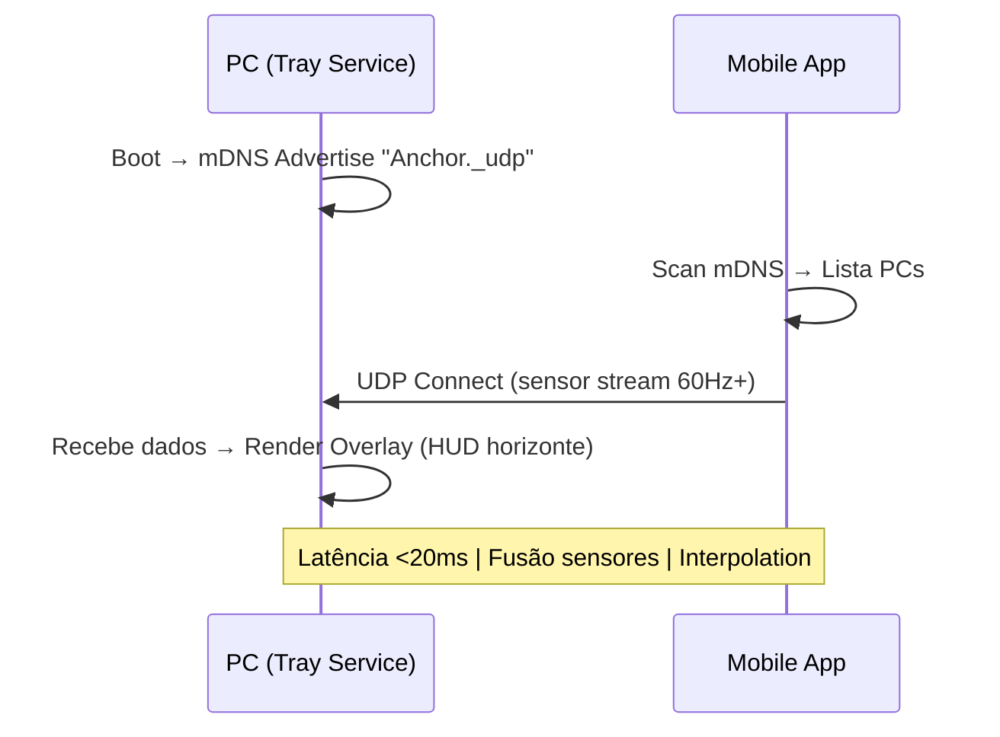

Olá! Tudo bem sim, obrigado. Li os dois documentos em [`docs/general/MissionBriefing.md`](docs/general/MissionBriefing.md) e [`docs/general/TecnicalMissionBriefing.md`](docs/general/TecnicalMissionBriefing.md), que dão um contexto perfeito: Anchor é um sistema de baixa latência para combater cinetose via horizonte artificial, com mobile (React Native) como sensor UDP publisher e desktop (Tauri Rust+React) como overlay receptor. Infra monorepo pronta com `packages/protocol` para tipos compartilhados. Excelente base!

Aqui vai minha opinião técnica direta sobre suas ideias, alinhada ao stack e desafios (latência <20ms, drift de sensores, overlay invisível/click-through):

### 1. **TrayApp no PC (barra de status, Win/Linux)**
   - **Acho ótima!** Tauri v2 suporta system tray nativamente via [`tauri-plugin-system-tray`](https://v2.tauri.app/plugin/system-tray/) (ou config direto em `src-tauri/tauri.conf.json`). Ícone na bandeja com menu contextual (conectar/desconectar, configs, status conexão). Leve (Rust consome ~10-20MB RAM idle), cross-platform (Win/Linux/Mac via tray icons). Perfeito para "invisibilidade" – app roda hidden, só ativa overlay quando mobile conecta.
   - **Vantagens:** Usuário não precisa abrir janela; clica tray → gerencia tudo. Evita poluição visual no desktop de trabalho.
   - **Cuidados:** No Linux, teste com GNOME/KDE (usa `libappindicator` ou `systray`). Win ok nativo.

### 2. **Auto-início no boot do PC (serviço leve sempre rodando)**
   - **Concordo 100%!** Torna o PC "sempre disponível". Tauri permite auto-launch:
     | OS       | Config                          |
     |----------|---------------------------------|
     | Windows  | Registry via `tauri-plugin-autostart` |
     | Linux    | `.desktop` file em `~/.config/autostart/` ou systemd user service |
     | Mac      | Login Items via plist           |
   - **Leveza:** Rust UDP listener em thread dedicada usa <1% CPU idle. Monitore com `htop` pós-impl.
   - **Segurança:** Bind UDP só em 0.0.0.0:porta específica (ex: 5353 mDNS + 7000 UDP data), firewall local network only.

### 3. **Descoberta mágica (sem IP manual) + Mobile conecta no PC**
   - **Ideia brilhante, viável com mDNS (ZeroConf)!** PC como server (anuncia serviço), mobile como client (descobre e conecta). Sem IP: rede local resolve automaticamente.
     - **Como funciona:**
       1. PC inicia → anuncia via mDNS: "AnchorPC._udp.local" com porta UDP data.
       2. Mobile scaneia rede → lista PCs disponíveis → user seleciona → envia UDP stream de sensores (gyro/accel fusion via Kalman/Complementary filter).
       3. PC recebe → renderiza overlay imediato (Canvas/WebGL 120fps, always-on-top, transparent, click-through via CSS `pointer-events: none` + toggle).
     - **Libs:**
       | Plataforma | Descoberta (mDNS)          | UDP Data     |
       |------------|----------------------------|--------------|
       | Rust (PC)  | `mdns` ou `zeroconf` crate | `udp-socket` |
       | RN (Mobile)| `react-native-zeroconf`    | `dgram` npm  |
     - **Latência:** mDNS discovery ~100ms, UDP fire-and-forget garante <20ms end-to-end em WiFi local (teste com `ping` RTT).
     - **Fallbacks:** Timeout 5s na conexão → UI "Procurando PC...". Se drop, interpolate último pacote (lerp para fluidez).
     - **Segurança:** mDNS local-only, opcional PIN via protocol para auth.

### Fluxo Geral Proposto (Mermaid para clareza):

**Pontos de risco/chave (do briefing):**
- **Drift sensores:** Mobile faz fusão básica (Complementary filter) antes de enviar.
- **Overlay:** React Canvas com `requestAnimationFrame`, sync com UDP via Rust invoke.
- **Rede:** WiFi 5GHz recomendado; teste em carro real (jitter).
- **Bateria mobile:** 60Hz sensores drena ~10-20%; throttle quando idle.

Acho factível em 1-2 semanas com stack atual. PC sempre-on + discovery mágica casa perfeito com "invisibilidade" e tempo-real.